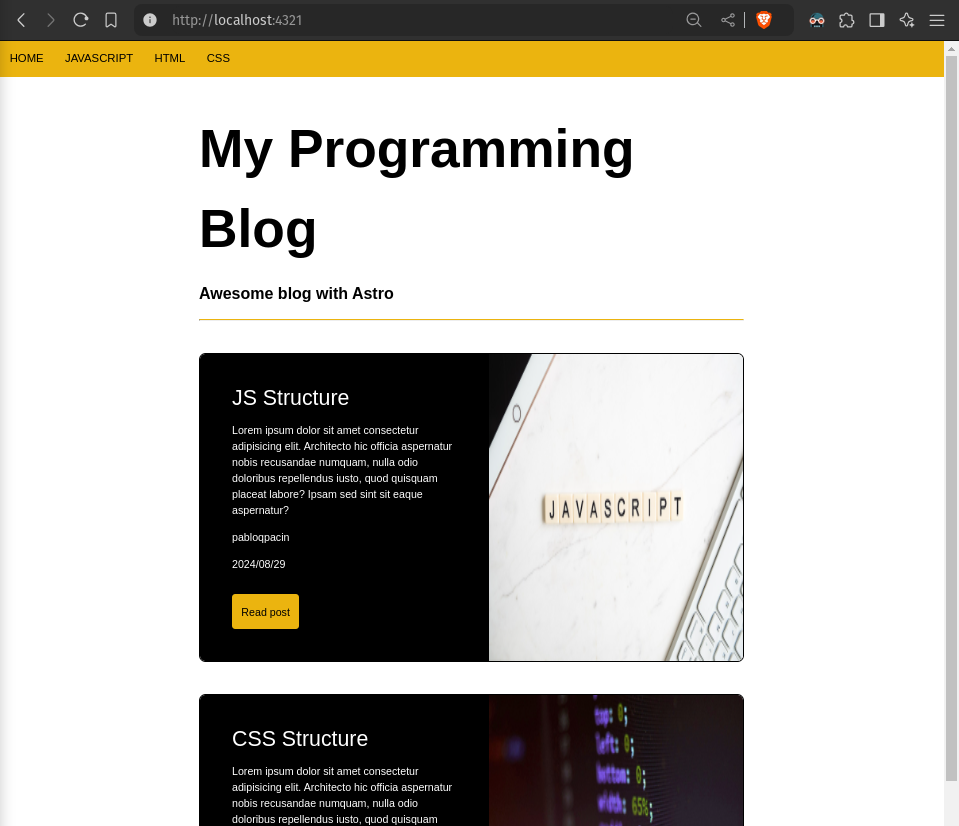
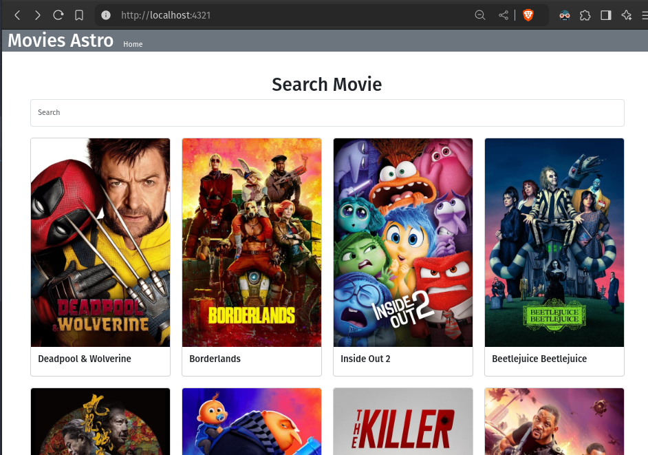
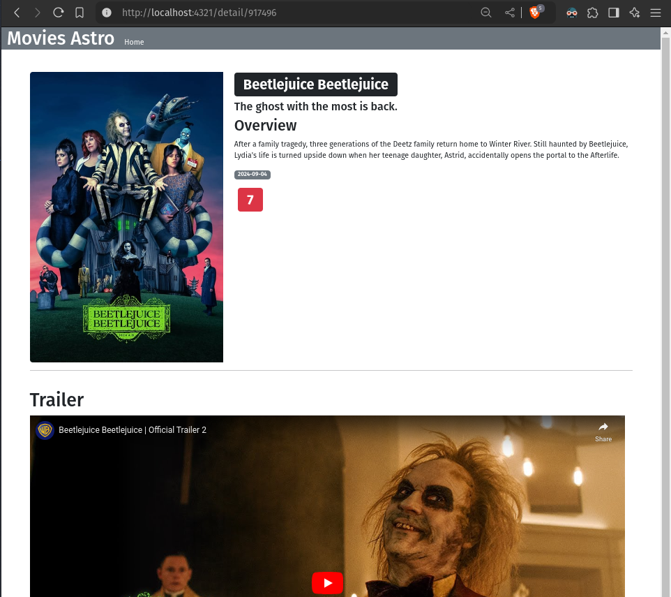
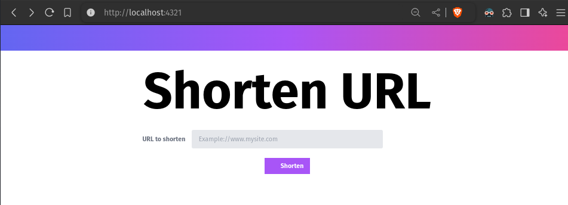
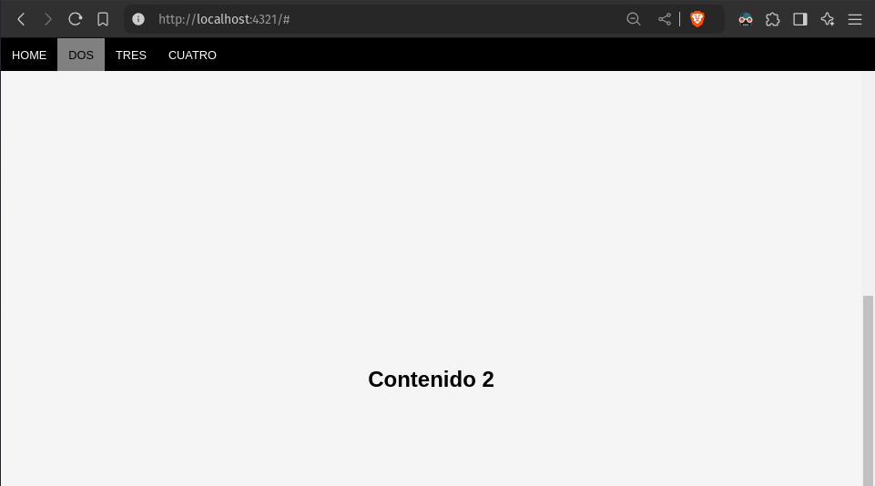
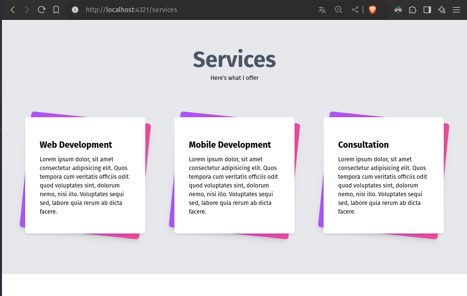
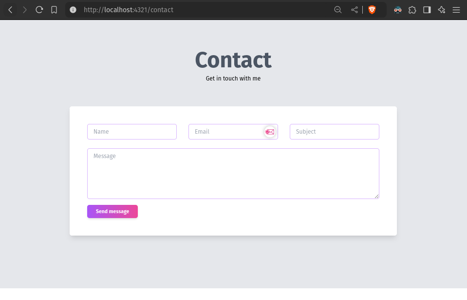
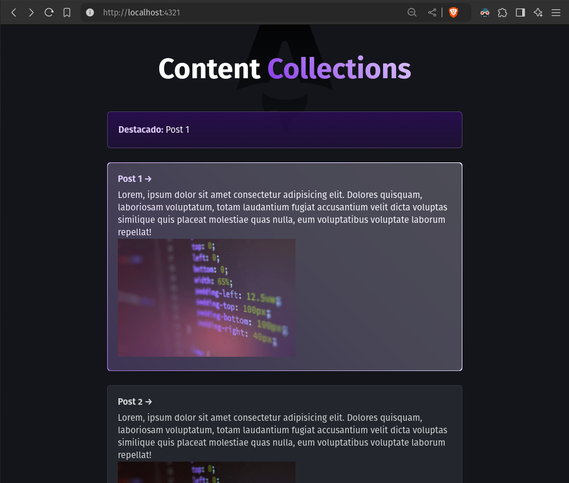
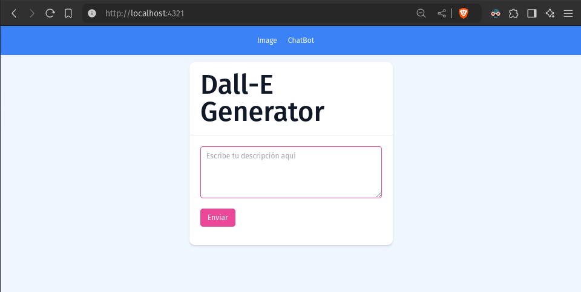

# pabloqpacin.github.io

## GitHub Pages + Astro

<!--
- [ ] https://jekyllrb.com/docs/posts/
- [ ] https://docs.github.com/en/pages/setting-up-a-github-pages-site-with-jekyll/adding-a-theme-to-your-github-pages-site-using-jekyll
- [ ] https://docs.github.com/en/pages/setting-up-a-github-pages-site-with-jekyll/about-github-pages-and-jekyll
- [ ] https://docs.github.com/en/pages/getting-started-with-github-pages/configuring-a-publishing-source-for-your-github-pages-site
- [ ] https://docs.astro.build/en/guides/deploy/github/
- [ ] https://astro.build/themes/
- [ ] https://docs.astro.build/en/basics/project-structure/
- [ ] https://astrofy-template.netlify.app/
-->

> Curso Udemy: [Desarrollo web ultra rápido con Astro](https://www.udemy.com/course/desarrollo-web-ultra-rapido-con-astro/?couponCode=SKILLS4SALEB)

Capturas de cada mini-proyecto y rama del curso

<table>
<thead>
  <th>Branch
  <th>Capturas
</thead>
<tbody>
  <tr>
    <td>s4_blogMD
    <td>
  </tr>
  <tr>
    <td rowspan="2">s5_APIpeliculas
    <td>
  </tr>
  <tr>
    <td>
  </tr>
  <tr>
    <td>s6_shortenUrls
    <td>
  </tr>
  <tr>
    <td>s7_scrollpage
    <td>
  </tr>
  <tr>
    <td rowspan="4">s8_portafolio
    <td>
  </tr>
  <tr>
    <td>
  </tr>
  <tr>
    <td>
  </tr>
  <tr>
    <td>
  </tr>
  <tr>
    <td>s9_contcoll_blogMD
    <td>
  </tr>
  <tr>
    <td>s10_openai
    <td>
  </tr>
</tbody>
</table>

 

- **pabloqpacin.github.io**
  - [x] https://docs.astro.build/en/guides/deploy/github/
  - [ ] SSR INOP on Github Pages ([no adapter](https://docs.astro.build/en/reference/errors/no-adapter-installed/))

